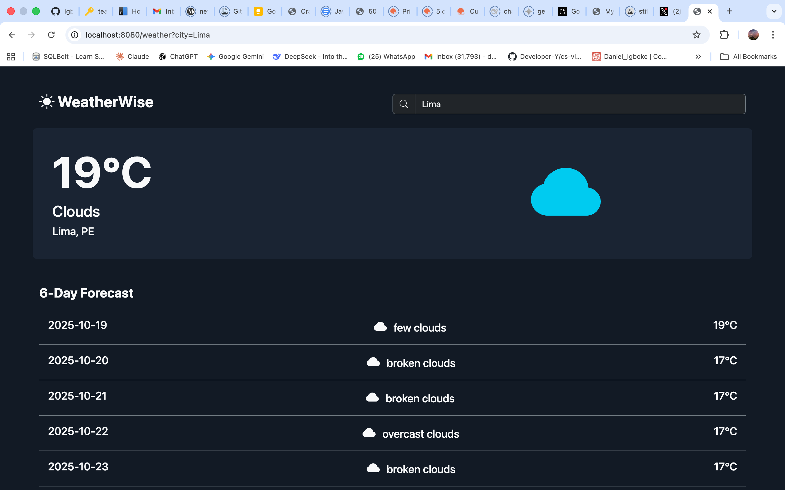
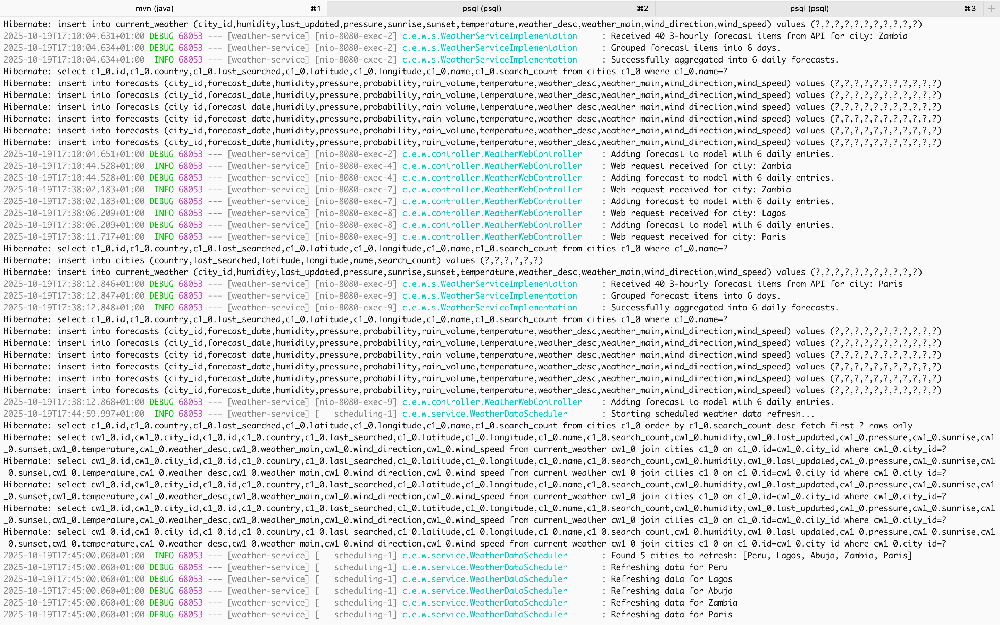

# WeatherWise: A Comprehensive Weather Forecast Service

WeatherWise is a full-featured, modern web application built with Java and Spring Boot that provides real-time weather data and multi-day forecasts. This project was developed using a strict Test-Driven Development (TDD) methodology, resulting in a robust, well-tested, and maintainable codebase.  
It serves as a complete demonstration of building a modern, full-stack Java application, from backend REST APIs and database integration to a dynamic, server-side rendered frontend, all packaged and orchestrated with Docker.



## Features

- **Current Weather Dashboard:** Get real-time weather data for any city, including temperature, humidity, wind conditions, and sunrise/sunset times, with dynamic weather icons.
- **Multi-Day Forecast:** View a 5-day aggregated forecast with daily high/low temperatures and weather descriptions.
- **Dynamic UI:** A clean, modern, and responsive user interface built with Thymeleaf and Bootstrap.
- **Popular Searches:** The home page dynamically displays the most frequently searched cities.
- **Robust Error Handling:** Custom, user-friendly error pages for the web UI and structured JSON error responses for the API.
- **RESTful API:** A well-defined API for fetching current weather and forecast data in JSON format.

## Architecture & Technical Design

- **Web Layer (controller):** Handles incoming HTTP requests for both the web UI (@Controller) and the REST API (@RestController).
- **Service Layer (service):** Contains all the core business logic, processing data, and coordinating with the data layer.It is decoupled from specific external providers via a WeatherProvider interface.  
- **Provider Layer (provider):** Contains concrete implementations for fetching data from external APIs (e.g., OpenWeatherMap). This layer is responsible for translating external data models into a clean, internal domain model (Anti-Corruption Layer).
- **Data Layer (repository, model):** Manages all database interactions using Spring Data JPA. The data model includes City, CurrentWeather, and Forecast entities with defined relationships.

<details>
<summary><strong>Click to see Backend Logs in Action</strong></summary>
<p>The application features a proactive caching scheduler, robust logging with SLF4J, and a full persistence layer with Hibernate and Flyway, as demonstrated in the console output.</p>

</details>

## Key Technical Features:
- **Test-Driven Development (TDD):** The entire application was built test-first, with a comprehensive suite of unit and integration tests covering every layer.
- **Caching:** A production-ready caching layer using Spring Cache and Caffeine is implemented to reduce latency and minimize external API calls. Caches are configured with appropriate Time-To-Live (TTL) policies.
- **Scheduled Tasks:** A background scheduler (@Scheduled) runs periodically to proactively refresh the weather data for the most popular cities, ensuring cached data remains fresh.
- **Database Migrations:** Database schema changes are managed reliably using Flyway, ensuring a consistent database state across all environments.
- **External API Integration:** Consumes the OpenWeatherMap API using Spring's RestTemplate. An Anti-Corruption Layer is used to decouple our internal models from the external API's structure.
- **Configuration Management:** Securely manages external configuration and API keys using application.properties and environment variables.

## DevOps & Deployment:

- **Continuous Integration (CI):** A GitHub Actions workflow automatically builds and runs the full test suite on every push and pull request, ensuring code integrity.
- **Containerization:** The application is packaged into a lean, multi-stage Dockerfile, creating a small and secure production image.
- **Orchestration:** Docker Compose is used to define and run the entire application stack (the Spring Boot application and the PostgreSQL database) with a single command, ensuring a consistent environment for development and deployment.

## Technology Stack

- Backend	Java 21, Spring Boot 3.x, Spring Web
- Data	Spring Data JPA, Hibernate, PostgreSQL
- Testing	JUnit 5, Mockito, AssertJ
- Frontend	Thymeleaf, Bootstrap 5
- Caching	Spring Cache, Caffeine
- DevOps	Docker, Docker Compose, GitHub Actions
- Tooling	Maven, Git, SLF4J for Logging
- Database	Flyway (Migrations)

## Getting Started with Docker (Recommended)

This is the simplest and recommended way to run the entire application stack.  

### Prerequisites

- Docker and Docker Compose
- An OpenWeatherMap API Key

### Instructions

1. Clone the Repository

```bash
git clone https://github.com/igboke/weather-service.git
cd weather-service
```

2. Setup Api Key

Create an environment variable for your OpenWeatherMap API key.

```bash
export OPENWEATHERMAP_API_KEY="your_actual_api_key" #bash
```

3. Run with Docker Compose:

Execute the following command from the project's root directory.

```bash
docker-compose up --build
```

**This single command will:**

- Build the application's Docker image from the Dockerfile.
- Start a PostgreSQL container.
- Start the application container.
- Connect them on a shared network.
- Flyway will automatically run the database migrations on startup.

4. Access the Application:

You can now access the application in your web browser at http://localhost:8080/

## Getting Started (Manual Set up)

Follow these instructions to get the project running on your local machine for development and testing purposes.

### Prerequisites

- Java JDK 21 or newer
- Apache Maven 3.8 or newer
- PostgreSQL database server
- An OpenWeatherMap API Key (you can get a free one from their website)

#### 1. Clone the Repository

```bash
git clone https://github.com/igboke/weather-service.git
cd weather-service
```

#### 2. Configure the Database

- Start your local PostgreSQL server.
- Create a new database for the project. For example, using psql:

```sql
CREATE DATABASE weatherdb;
```

- Create a user and grant it permissions to the new database.

#### 3. Configure the Application

- Navigate to src/main/resources/.
- Rename the file application.properties.example to application.properties.
- Open application.properties and fill in your PostgreSQL database details (spring.datasource.url, username, password).

#### 4. Set the API Key

This project uses an environment variable to securely load the OpenWeatherMap API key.

```bash
export OPENWEATHERMAP_API_KEY="your_actual_api_key" #On macOS/Linux
```

```bash
set OPENWEATHERMAP_API_KEY="your_actual_api_key" #On Windows (Command Prompt)
```

#### 5. Build and Run the Application

You can build and run the project using the Spring Boot Maven plugin.

```bash
mvn spring-boot:run
```

The application will start up, and Flyway will automatically run the database migrations to create the necessary tables.  
See Tables in [TDD](TDD.md).  
You can now access the application in your web browser at http://localhost:8080/.  

### Running Tests

To run the comprehensive test suite without starting the application, use the Maven test command:

```bash
mvn test
```

### API Endpoints

The application exposes the following RESTful API endpoints:  
- Get Current Weather: `GET` /api/weather/current?city={cityName}
- Get 5-Day Forecast (including today): `GET` /api/weather/forecast?city={cityName}


